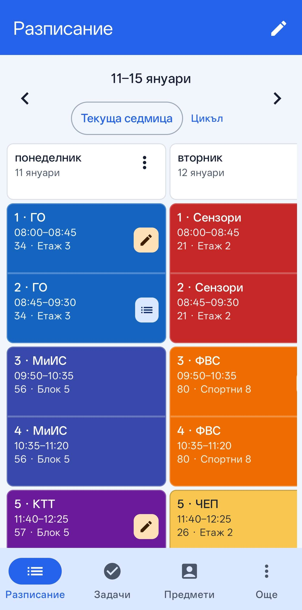
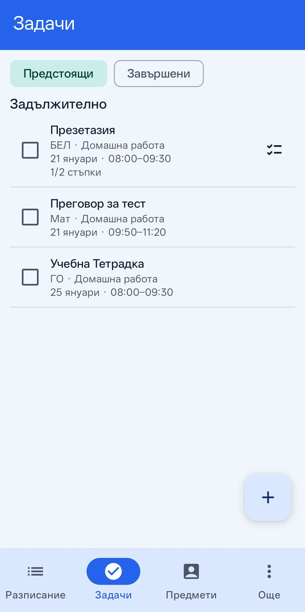
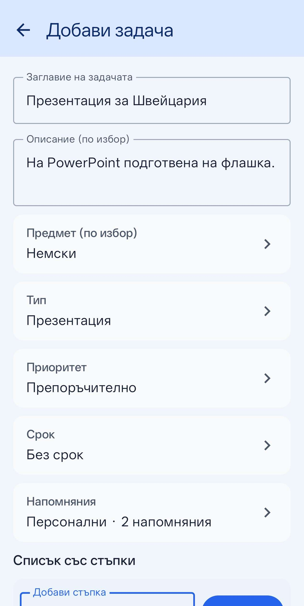
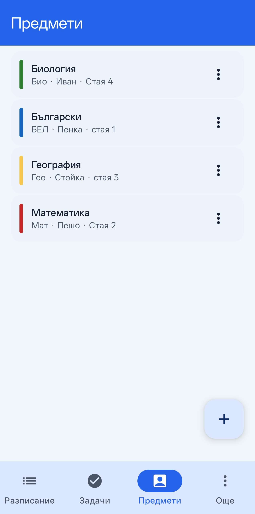
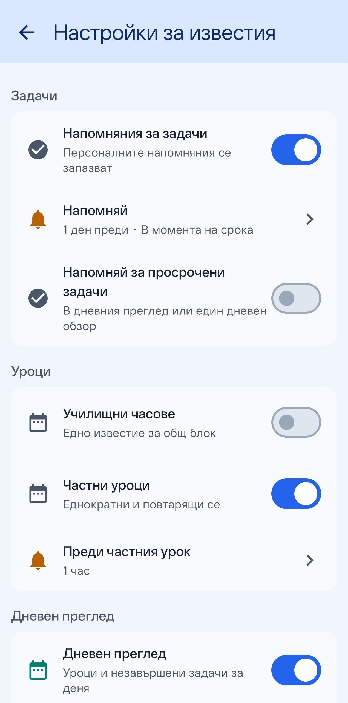
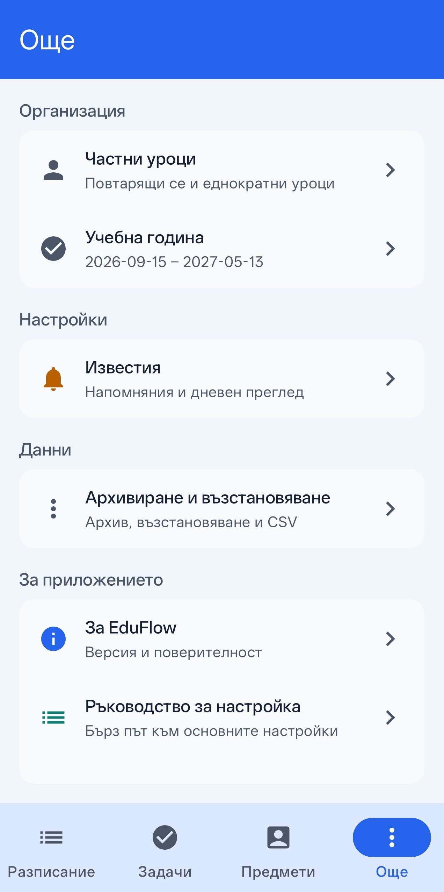

# EduFlow

**Your school life, organized.**

EduFlow is a local-first Android student planner for managing school timetables, homework, private lessons, reminders, events, and academic planning. The current interface is Bulgarian-first.

## Overview

Plan each school week, keep coursework connected to the lessons it belongs to, and keep private lessons and reminders in the same place.

## Features

### Schedule

- A/B school timetables and dated weekly schedules.
- SCHOOL lesson instances with visual lesson blocks, including same-subject and mixed-subject logical blocks.
- Lesson cancellation and restoration, no-school days, and timetable events.

### Tasks

- Homework and tasks with types, priorities, checklists, and exact deadlines.
- Lesson-based deadlines such as “for the next lesson” and “for the lesson after next.”
- Intended deadlines can be forwarded reversibly when a relevant lesson becomes unavailable.
- Share individual tasks or homework as `.eduflowtask` files, review the import, and map the Subject when needed.

### Lessons

- SCHOOL lesson details with topics and notes.
- One-off and recurring PRIVATE lessons, with independent tutor and location information.

### Notifications

- Task reminders with configurable timing.
- SCHOOL and PRIVATE lesson reminders with separate, custom lead times.
- Daily Overview and Quiet Hours settings.

### Data and usability

- Local-first storage, backup/archive creation and restore/import, plus selected data export.
- Onboarding/setup guide and launcher shortcuts for common actions.

## Screenshots

<table>
  <tr>
    <td align="center"><strong>Schedule</strong> </td>
    <td align="center"><strong>Tasks</strong> </td>
  </tr>
  <tr>
    <td align="center"><strong>Task editor</strong> </td>
    <td align="center"><strong>Subjects</strong> </td>
  </tr>
  <tr>
    <td align="center"><strong>Notification settings</strong> </td>
    <td align="center"><strong>More / Settings</strong> </td>
  </tr>
</table>

## Download and installation

Download the latest APK from the repository’s Releases page. Normal users should install **`app-release.apk`**; an AAB is not an artifact for direct sideloading.

1. Open the latest GitHub Release.
2. Download the APK.
3. Open the downloaded APK.
4. If Android asks, allow installation from that source.
5. Install EduFlow.

Future APK releases signed with the same EduFlow production certificate can update an installed copy without deleting its data, subject to Android’s normal version and update rules.

## Privacy and local-first design

Your schedule, tasks, private-lesson details, and lesson notes are stored on the device. Backups and exports are created only when you initiate them. See [PRIVACY.md](PRIVACY.md) for details and caveats.

## Requirements

- Android device running a supported Android version for the release APK.
- For source builds: Android Studio, JDK 17, and the Android SDK configured locally.

## Tech stack

- Kotlin
- Jetpack Compose
- Room
- DataStore
- WorkManager
- Android Studio / Gradle

## Build from source

1. Clone the repository and open it in Android Studio.
2. Configure a local Android SDK (`local.properties` is intentionally not committed).
3. Use JDK 17 and let Gradle sync the project.
4. Build and run a debug variant from Android Studio, or run `./gradlew assembleDebug`.

## Release builds

Release signing is configured from local environment variables and signing material that are intentionally excluded from the repository. Do not commit a keystore, signing properties, or passwords. End users install the release APK, not the AAB.

## Project status

EduFlow v1.1.0 is the current stable release.

## Feedback and bug reports

Use the in-app feedback option or open a GitHub issue after the repository is published. Please remove personal school information from screenshots, logs, and reports.

## Author

EduFlow is an Android project by **DGtao13**.

No license has been selected for this repository yet; making the source public does not itself grant reuse rights.
